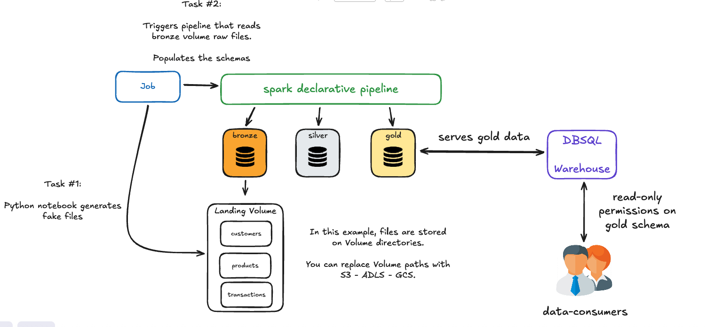
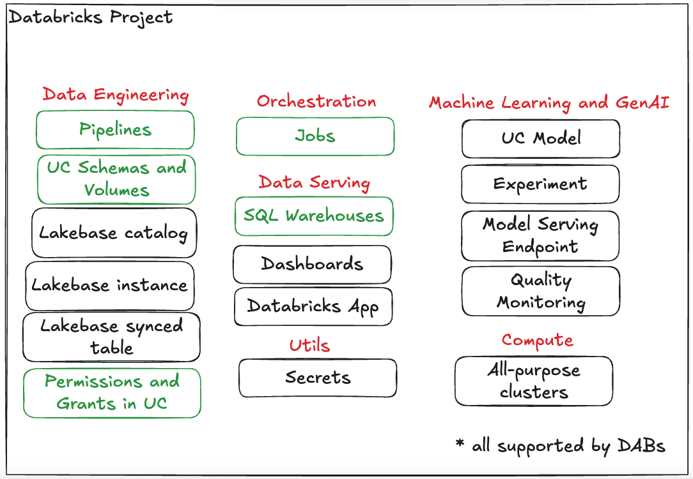

# Medallion Architecture on Unity Catalog using DABs

A DABs implementation of a medallion arquitecture pipeline in Unity Catalog.

# Databricks and Unity Catalog resources created.

For this project, the resources highlighted in green were required.

* [DABs Supported resources
](https://docs.databricks.com/aws/en/dev-tools/bundles/resources)

- Unity Catalog:
    - Three schemas:
        - bronze
        - silver
        - gold
    - A volume:
        - landing volume (on the bronze schema)

- Workspace Assets:
    - A job:
        - two tasks:
            - task #1: generates fake parquet files on the landing volume.
            - task #2: triggers the declarative pipeline.
    - A declarative pipeline: 
        - reads from the landing volume.
        - generates tables on bronze, silver and gold schemas.

    - A DBSQL Warehouse.

## Prerequisites

* Databricks CLI v0.269.0 or above

## Youtube Walkthrough

